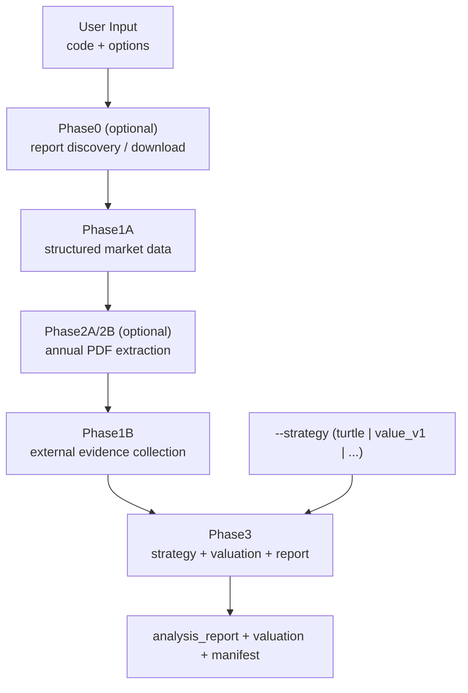

# trade-signal-schema-kit

面向 A 股与港股的 **TypeScript 研究编排框架**：以 `schema-core` 标准字段与 Provider 契约为轴，串联采集、（可选）年报 PDF 精提取、外部证据、策略评估、估值与报告输出，并配套 **质量门禁**。**A 股优先**；港股具备门禁基线，与 A 股同等深度能力仍在补齐。**版本**：v0.1-alpha。

日常推荐在 **Claude Code** 里用 Slash 命令驱动；CLI 用于脚本化、CI 与无 IDE 环境。Stage / Phase、续跑与 output v2 见 [docs/guides/workflows.md](docs/guides/workflows.md)；数据契约见 [docs/guides/data-source.md](docs/guides/data-source.md)。**证据包（CLI）与六维终稿叙事（Claude）**的职责划分见 [docs/guides/entrypoint-narrative-contract.md](docs/guides/entrypoint-narrative-contract.md)。

## 术语速记

- **入口（entrypoint）**：`/workflow-analysis`、`/business-analysis`、`/valuation`
- **策略（strategy）**：`turtle`、`value_v1`（通过 `--strategy` 切换）
- **阶段命名**：文档主叙事用 Stage A~E，代码实现名用 Phase 0~3（语义一一对应）
- **顺序规则**：有 PDF 时走 `Phase1A → Phase2A/2B → Phase1B → Phase3`；无 PDF 时走 `Phase1A → Phase1B → Phase3`
- **evidence-pack**：`data_pack_*` 与 Phase1B 等确定性编排产物（**cli-evidence-only** 时 CLI 不宣称已完成 AI 终稿）
- **final-narrative**：六维定性终稿，**默认在 Claude Code**（Slash / Skills / 会话）写回 `qualitative_report.md` / `qualitative_d1_d6.md`；TS 编排层不调模型厂商叙事 API

## 核心功能总览

| 模块 | Slash（推荐） | 关键产物 |
|------|----------------|----------|
| 全流程研究 | `/workflow-analysis` | `analysis_report.md` / `analysis_report.html`、`valuation_computed.json`、`workflow_manifest.json`（定性深度补强见契约文档） |
| 商业分析（PDF-first） | `/business-analysis` | **证据包** `data_pack_*` + **草稿** `qualitative_*`；**终稿叙事**于 Claude 会话写回（见 [entrypoint-narrative-contract](docs/guides/entrypoint-narrative-contract.md)） |
| 独立估值 | `/valuation` | `valuation_computed.json`、`valuation_summary.md`（可选 `--full-report`；**非**叙事入口） |
| 年报下载 | `/download-annual-report` | 本地缓存 PDF（见 [Phase 0](docs/guides/phase0-download.md)；**非**叙事入口） |
| MD → HTML | `/report-to-html` | 与输入同名的 `.html`（**仅**版式，不生成叙事） |
| 选股器 | —（CLI） | 见 [workflows](docs/guides/workflows.md) 中 `screener` |

## 架构图（UML）



## 三种上手（Claude Code）

在仓库根打开 Claude Code，将 **`600887` 换成你的股票代码** 后可直接输入：

### 1) 全流程到终稿

```
/workflow-analysis 600887
```

一次跑完 **Phase0（可选）→ Phase1A →（有年报 PDF 时）Phase2A/2B → Phase1B → Phase3**。先看 `analysis_report.md/html`、`valuation_computed.json`、`workflow_manifest.json`。

### 2) PDF-first 商业分析

```
/business-analysis 600887
```

跑定性主链（不跑完整 Phase3）。先看 **证据包** `data_pack_*` 与 manifest；`qualitative_*` 在纯 CLI 下为草稿，**终稿**需在 Claude 会话按 skill 收口（见 [entrypoint-narrative-contract](docs/guides/entrypoint-narrative-contract.md)）。

### 3) 独立估值

```
/valuation 600887
```

独立跑估值（常配合 `--from-manifest`）。先看 `valuation_computed.json`、`valuation_summary.md`。

### 如何切换策略（重点）

- **Slash**：在入口后追加 `--strategy`，例如  
  `/workflow-analysis 600887 --strategy value_v1`
- **CLI**：传 `--strategy` 参数，例如：

```bash
pnpm run workflow:run -- \
  --code 600887 \
  --mode turtle-strict \
  --strategy value_v1
```

当前常用策略：`turtle`、`value_v1`。入口是编排，策略是参数维度。

Slash 参数与检查清单：`.claude/commands/*.md`、`.claude/skills/`；环境变量与 Feed：[docs/guides/data-source.md](docs/guides/data-source.md)。

## 入口选择（目标 → 命令 → 产物）

| 你的目标 | 先执行（推荐） | 典型产物 | 下一步 |
|----------|----------------|----------|--------|
| 一次跑完采集 →（可选）年报 → 外部补充 → 策略/估值/终稿 | `/workflow-analysis` | `analysis_report.*`、`valuation_computed.json`、`workflow_manifest.json` | 若要 HTML，可用 `/report-to-html` |
| PDF-first 商业定性（可接全链路 / 估值） | `/business-analysis` | `qualitative_*`、`data_pack_*`、`business_analysis_manifest.json` | manifest 建议命令 → `/workflow-analysis` 或 `/valuation` |
| 只要估值 JSON（与摘要） | `/valuation`（或先备好 manifest） | `valuation_computed.json`、`valuation_summary.md` | 缺输入时先 `/business-analysis` |
| universe 批量筛选 | — | （见 screener 文档） | `pnpm run screener:run -- ...`（路径见 [workflows](docs/guides/workflows.md)） |
| 只下载/缓存年报 PDF | `/download-annual-report` | 缓存 PDF | 再 `/business-analysis` 或 `/workflow-analysis` |
| Markdown → HTML | `/report-to-html` | `.html` | — |

Slash 与 CLI 一一映射：`/workflow-analysis` → `workflow:run`、`/business-analysis` → `business-analysis:run`、`/valuation` → `valuation:run`。

## 当前主要能力与边界

| 类别 | 说明 |
|------|------|
| **主要能力** | 全流程 `/workflow-analysis`、商业分析 `/business-analysis`、独立估值、独立 Phase3（包内 `run:phase3`）、年报获取、选股器、MD→HTML |
| **设计原则** | 研究层只消费标准字段；HTTP/MCP 语义对齐；策略可插拔（如 Turtle）。详见 [CLAUDE.md](CLAUDE.md) |
| **非目标** | 非实时交易、非自动下单；产物默认在本机 `output/`（门禁基线 `output/phase3_golden/` 见 [data-source](docs/guides/data-source.md)） |

`business_analysis_manifest.json` / `workflow_manifest.json` 含 `pipeline.valuation.relativePaths` 与 `outputLayout`（`manifestVersion` 为 `2.0`）。目录规则见 [workflows.md](docs/guides/workflows.md)。

## 质量门禁

```bash
pnpm run quality:all
pnpm run test:linkage   # build + 链路烟测
```

`contract` / `regression` / `phase3-golden` 依赖仓库内 **`output/phase3_golden/`**；误删后见 [data-source.md](docs/guides/data-source.md)。

**Feed、续跑、排障**：[docs/guides/data-source.md](docs/guides/data-source.md)；模板：`.env.example`、`.env.full.example`。

## 更多文档

- [入口与 AI 叙事契约（单一路径）](docs/guides/entrypoint-narrative-contract.md)
- [流程与 CLI 细节](docs/guides/workflows.md)
- [数据契约与 quality](docs/guides/data-source.md)
- [环境配置与实操](docs/guides/data-source.md)
- [路线图](docs/strategy/strategy-roadmap.md)
- [文档总索引](docs/README.md)
- [Claude Code 指引](CLAUDE.md)

## CLI 附录（Slash 对等命令）

任意 `@trade-signal/research-strategies` CLI 前需先有 `dist/`：

```bash
pnpm install
pnpm run typecheck
pnpm run build
```

以下示例中 **`600887` 可替换为任意标的代码**；仓库根执行，需配置 **`FEED_BASE_URL`**（见 [data-source](docs/guides/data-source.md)）。

### `/workflow-analysis` → `workflow:run --mode turtle-strict`

```bash
pnpm run workflow:run -- \
  --code 600887 \
  --year 2024 \
  --mode turtle-strict \
  --pdf "./path/to/annual.pdf" \
  --output-dir "./output/workflow/600887"
  # 可选：--run-id <固定子目录名>；续跑见 workflows.md（--resume-from-stage 时以 checkpoint 为准）
```

### `/business-analysis` → `business-analysis:run`

```bash
pnpm run business-analysis:run -- \
  --code 600887 \
  --year 2024 \
  --output-dir "./output/business-analysis/600887"
  # 可加 --strict、--mode turtle-strict、--strategy turtle|value_v1
```

产物在 `./output/business-analysis/600887/<runId>/`（无 `--pdf`/`--report-url` 时会 best-effort 自动发现年报）。

### `/valuation` → `valuation:run`

从 **manifest** 解析路径（推荐，与 Slash 衔接一致）：

```bash
pnpm run valuation:run -- \
  --from-manifest "./output/business-analysis/600887/<runId>/business_analysis_manifest.json"
```

> 说明：`--from-manifest` 且默认 `--output-dir output` 时，估值写入 manifest 所在 run 目录；未传 `--code` 时分区回退到 **`manifest.outputLayout.code`**（见 [workflows](docs/guides/workflows.md)）。

### `/report-to-html` → `report-to-html:run`

```bash
pnpm run report-to-html:run -- \
  --input-md "./output/workflow/600887/<runId>/analysis_report.md" \
  --code 600887
```

**`apps/screener-web`**：已冻结；选股器统一使用 `pnpm run screener:run` 与 `output/screener/*` 产物，不再维护独立 Web 壳层入口。

## 参考

[Turtle_investment_framework](https://github.com/terancejiang/Turtle_investment_framework)（本仓库内对照：`references/projects/Turtle_investment_framework/`）

## License

MIT
