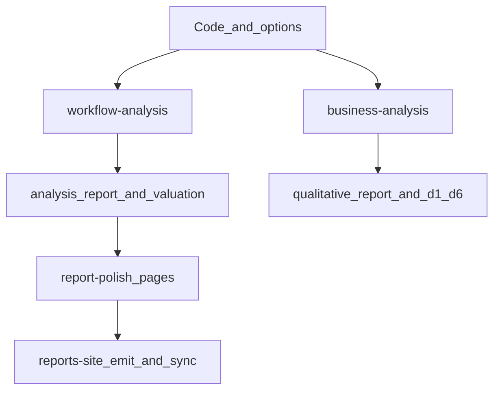

# trade-signal-schema-kit

面向 A 股与港股的 **TypeScript 研究编排框架**：统一字段契约（`schema-core`）+ Provider 适配（默认 HTTP，MCP 可选）+ 编排（采集、PDF 提取、外部证据、策略评估、估值、发布）。

> 快速原则：README 负责入口导航；参数细节与流程真源在 `docs/guides/workflows.md`。

## 核心边界（先看）

- **`/workflow-analysis`**：产出 Phase3 规则报告 + **report-polish** 发布稿（`report_view_model.json` + 四页 Markdown）。
- **`/business-analysis`**：产出证据包并在 Claude 会话完成 **六维终稿写回**（`qualitative_report.md` / `qualitative_d1_d6.md`）。
- **`analysis_report.md`**：规则审计产物，不是站点最终排版页。

更多定义见：
- [入口与叙事契约](docs/guides/entrypoint-narrative-contract.md)
- [report-polish 约束](docs/guides/report-polish-narrative-contract.md)

## 简版架构图



## 入口矩阵

| 目标 | Slash | Root CLI | 关键产物 |
|------|-------|----------|----------|
| 全流程（严格） | `/workflow-analysis` | `pnpm run workflow:run -- --mode turtle-strict ...` | `analysis_report.md`、`valuation_computed.json`、`workflow_manifest.json`、report-polish 四页 + `report_view_model.json` |
| PDF-first 商业分析 | `/business-analysis` | `pnpm run business-analysis:run -- ...` | `data_pack_*`、`business_analysis_manifest.json`、`qualitative_*`（CLI 可为草稿，终稿由 Claude 会话写回） |
| 独立估值 | `/valuation` | `pnpm run valuation:run -- ...` | `valuation_computed.json`、`valuation_summary.md` |
| 年报下载 | `/download-annual-report` | `pnpm run phase0:download -- ...` | 本地 PDF |
| 研报站聚合发布 | — | `pnpm run reports-site:emit -- --run-dir ...` → `pnpm run sync:reports-to-app` | `output/site/reports/**` → `apps/research-hub/public/reports` |

## 三种上手（Claude Code）

```text
/workflow-analysis 600887
/business-analysis 600887
/valuation 600887
```

策略切换示例：

```text
/workflow-analysis 600887 --strategy value_v1
```

## 最小命令集（CLI）

```bash
pnpm install
pnpm run build
pnpm run test:linkage
pnpm run workflow:run -- --code <CODE> --mode turtle-strict [--pdf ...] [--output-dir ...]
pnpm run business-analysis:run -- --code <CODE> [--strict] [--output-dir ...]
pnpm run reports-site:emit -- --run-dir ./output/workflow/<code>/<runId>
pnpm run sync:reports-to-app
```

更多（`typecheck`、`quality:all`、screener、output v2、续跑）统一见 [workflows.md](docs/guides/workflows.md)。

## 数据通道说明（HTTP / MCP）

- **默认推荐**：HTTP（开箱即用，主链路默认语义）。
- **MCP**：保留为可选高级通道（如 `--phase1b-channel mcp`），用于特定集成场景；目前不是日常默认路径。
- 两种通道的契约一致性由质量门禁覆盖（见 `quality:conformance` 相关说明）。

## 质量门禁

```bash
pnpm run quality:all
pnpm run test:linkage
```

说明：`quality:all` 覆盖 conformance/contract/regression/phase3-golden（`cn_a` + `hk`）。

## 文档导航

- [流程与 CLI 真源](docs/guides/workflows.md)
- [入口与 AI 叙事契约](docs/guides/entrypoint-narrative-contract.md)
- [数据源与环境变量](docs/guides/data-source.md)
- [研报站发布链路](docs/guides/reports-site-publish.md)
- [文档总索引](docs/README.md)
- [Claude Code 仓库内指引](CLAUDE.md)

## 参考与许可

- 参考工程：[Turtle_investment_framework](https://github.com/terancejiang/Turtle_investment_framework)（本仓库镜像路径：`references/projects/Turtle_investment_framework/`）
- License: MIT
